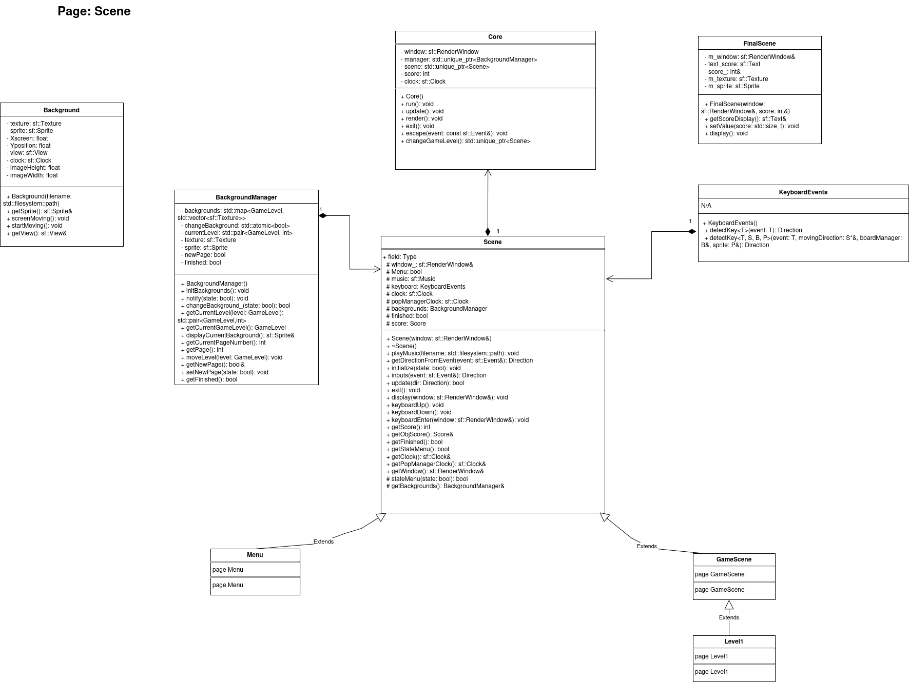
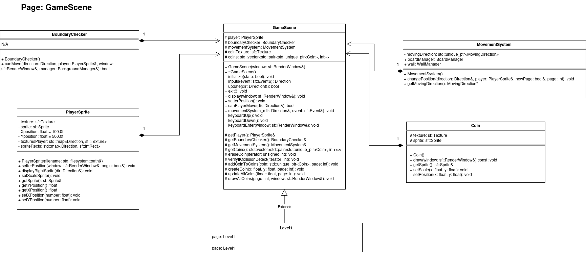
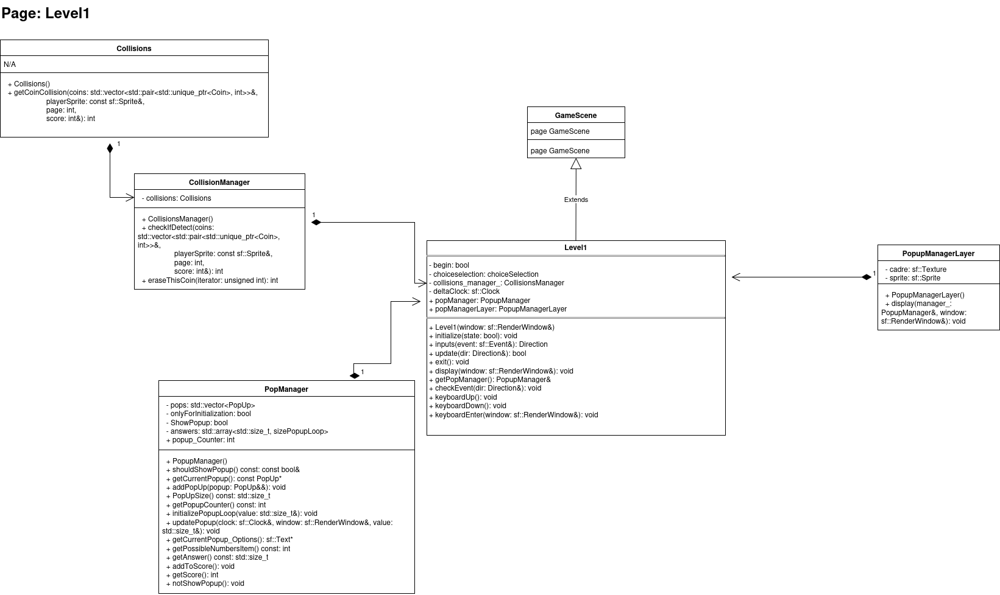
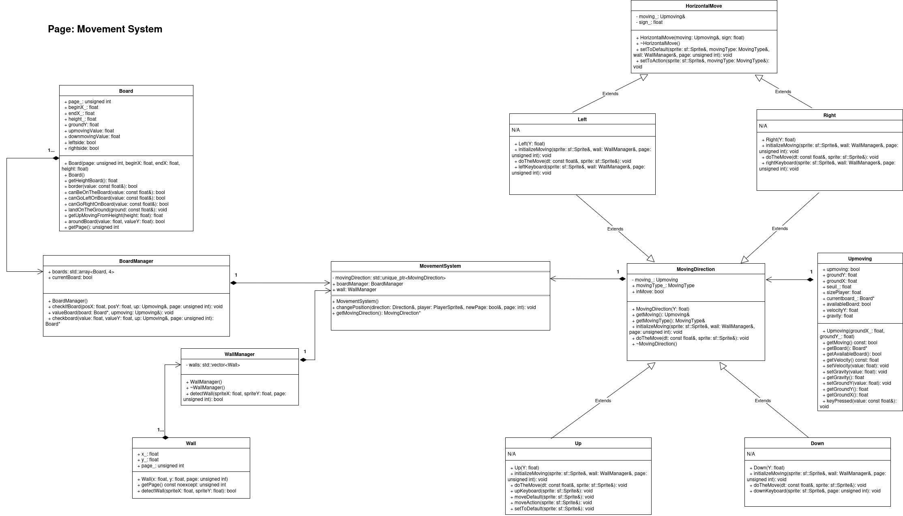
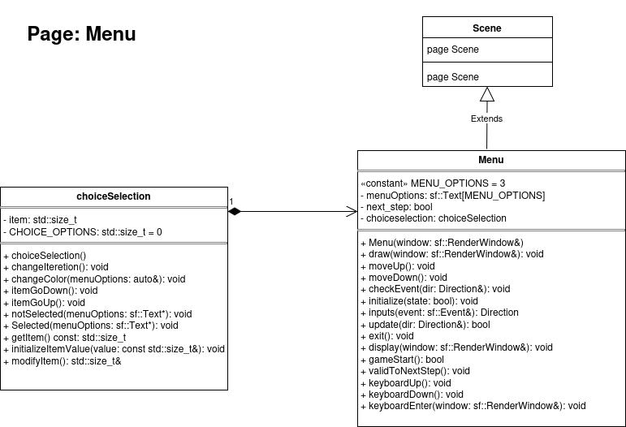

# FlightToHFT

## About

For developing and improving my design and architectural skills, and because of my passion
for hardware and software, I decided to create a 2D adventure game with PopUps about hardware
and software knowledge, covering topics such as multithreading, low latency, and other hardware-related concepts.

## Project requirements

### SFML
- Components used: System, Window, Graphics, Audio, Network
- Version: 3.0.0
- Installation:
- 
> I installed SFML 3.0.0 manually on Ubuntu  
> with headers in `/usr/include` and libraries in `/usr/lib`.


## How to launch the project

Open a terminal and run:

```bash
cd ~/FlightToHFT++/
rm -rf build        # remove old build
mkdir build
cd build
cmake ..
cmake --build .
./FlightToHFT__      # run the game
```
# UML Diagrams

## Page 1


## Page 2


## Page 3


## Page 4


## Page 5
